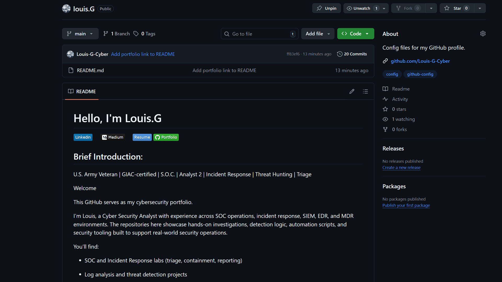

# GitHub-README-Creation
## Project Title: GitHub README Creation

## Role: Creator & Developer

## Description:
Designed and implemented a professional GitHub README to serve as a personal cybersecurity portfolio landing page. This project showcases Markdown proficiency, badge creation with Shields.io, and clean, navigable documentation to highlight skills, projects, and certifications.

## Key Contributions:

- Structured a clear and visually appealing README with sections for:

- Professional introduction

- Certifications

- Current studies and learning

- Soft skills

- Career goals and project list

- Created clickable badges linking to:

- LinkedIn profile

- Medium blog

- Portfolio resume hosted on GitHub

- Ensured badges are evenly spaced and visually consistent using &nbsp; in Markdown

- Designed README layout for clarity, professional presentation, and easy navigation

  ## README Demo Slideshow

Here’s an animated view of the GitHub README Creation project:

